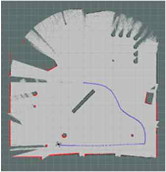
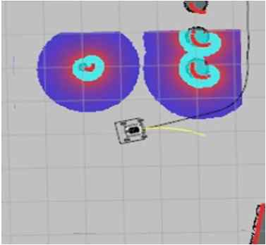

# Agilex-Scout-Mini-Gazebo-Navigation
ROS Navigation Stack with AgileX scout-mini Gazebo Simulator.

## Environment Setting and Download Packages

### **1. Install the Gazebo software**

* Gazebo is a robot simulator. Gazebo simulates multiple robots in a 3D environments, with extensive dynamic interaction between objects.
* Gazebo Download Link: [http://gazebosim.org](http://gazebosim.org/)
* Download and install gazebo. You can go to the website : <http://gazebosim.org/install>

### **2. Install Packages**

1. **Development Environment**
    * ubuntu 20.04
    * [ROS Noetic desktop full](http://wiki.ros.org/noetic/Installation/Ubuntu)

2. **Build ROS packages for ROS navigation stack**

    Create your own workspace, and git clone scout_mini sub-folder in codes repository.   

    ```
    mkdir ~/scout_ws/src
    cd ~/scout_ws/src
    git init
    git remote add origin https://github.com/rml-unist/codes.git
    git config core.sparsecheckout true
    echo scout_mini/* >> .git/info/sparse-checkout
    git pull origin scout_mini
    ```

3. **Install required ROS packages**

    ```(dependencies) and build from source
    cd scout_mini
    sh install_packages.sh
    ```
    Gmapping, Navigation, and Robot_localization packages will be downloaded.

4. **Install dependencies and build**

    ```
    cd ~/scout_ws
    rosdep install --from-paths src --ignore-src -r -y
    catkin_make
    ```
    **rosdep install** command will automatically install the required dependencies for the packages in the workspace. The dependencies are listed in CMakeLists.txt file in the packages.

## Implementation of AgileX scout-mini gazebo simulator

### **0. (Optional) Simple Test**

1. **Display platform description in RVIZ**
    ```
    cd ~/scout_ws
    source devel/setup.bash
    roslaunch scout_description display_scout_mini.launch 
    ```
    This will show you default vehicle platform without additional sensors.

2. **Launch gazebo simulator and teleop control**

    a. Launch gazebo simulator
    ```
    cd ~/scout_ws
    source devel/setup.bash
    roslaunch scout_gazebo_sim scout_mini_empty_world.launch
    ```

    b. Run teleop controller (move: w, a, x, d / stop: s)

    ```
    cd ~/scout_ws
    source devel/setup.bash
    roslaunch scout_teleop scout_teleop_key.launch 
    ```

### **1. SLAM for mapping**

* Before running any command below, write down "source devel/setup.bash" in terminal.

1. **Run Simulator**

    ```
    roslaunch scout_gazebo_sim scout_mini_playpen.launch
    ```

2. **Get Odometry & Sensor Fusion with imu sensor by Kalman Filter Localization**
    ```
    roslaunch scout_base scout_mini_base.launch
    ```

    ```
    roslaunch scout_filter ekf_filter_cmd.launch
    ```

2. **SLAM mapping**

    a. Gmapping

    ```
    roslaunch scout_slam scout_slam.launch
    ```

    b. Drive & mapping

    ```
    roslaunch scout_teleop scout_teleop_key.launch
    ```

    c. Save map

    ```
    roslaunch scout_slam gmapping_save.launch
    ```
    - default map file name: map1
    - map file will be saved in "scout_bringup/scout_slam/maps"
    - you can change saved map file name in the launch file
    - or you can set file name
        ```
        roslaunch scout_slam gmapping_save.launch map_file:=(file name)
        ```

### 2. **2D Navigation**

* For 2D navigation, there must be map.pgm file in scout_bringup/scout_slam/maps directory.   
* Check the image path in map.yaml file.   
* Before running any command below, write down "source devel/setup.bash" in terminal.

1. **Run Simulator**

    ```
    roslaunch scout_gazebo_sim scout_mini_playpen.launch
    ```

2. **Get Odometry & Sensor Fusion with imu sensor by Kalman Filter Localization**

    ```
    roslaunch scout_base scout_mini_base.launch
    ```

    ```
    roslaunch scout_filter ekf_filter_cmd.launch
    ```

2. **Run Navigation**

    ```
    roslaunch scout_navigation scout_navigation.launch
    ```
    you can set the goal position via "2D Nav Goal" button in rviz

## More Information

### Simulator Examples





### Sensor settings

* Please refer [sensor directory](/sensor)

### References

* [agilexrobotics/scout_ros github repo](https://github.com/agilexrobotics/scout_ros)